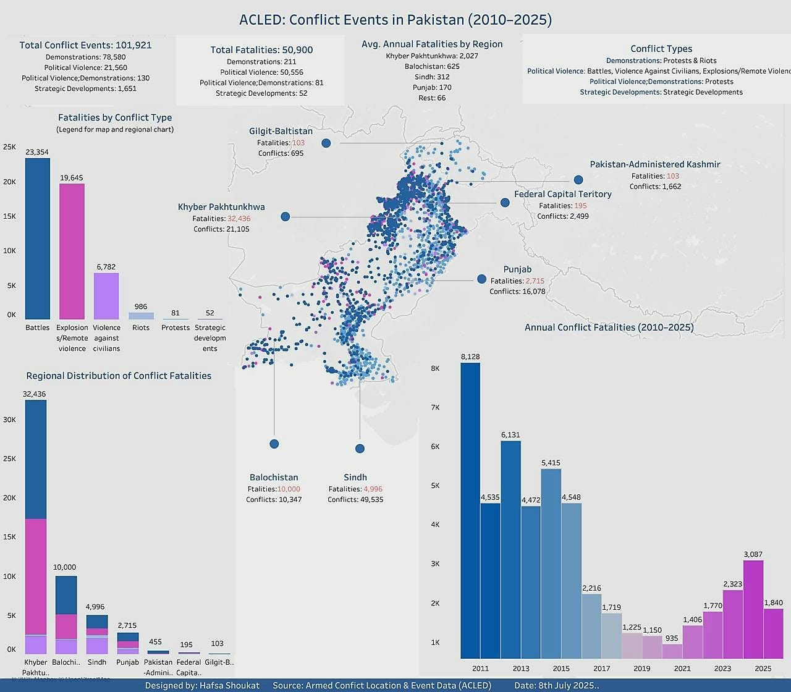

# Conflict Events in Pakistan (2010–2025)

This project visualises conflict events and fatalities in Pakistan between 2010 and 2025 using data from the Armed Conflict Location & Event Data (ACLED) project.

## 📊 Dashboard Features
- Total fatalities and conflict events across Pakistan
- Regional and annual breakdowns
- Conflict types (battles, explosions, riots, etc.)
- Custom-designed map using Mapbox
- Created in Tableau Public

## 🔍 Key Insights
- Khyber Pakhtunkhwa and Balochistan were the most affected regions
- Battles and explosions accounted for over 80% of fatalities
- Fatalities decreased after 2016 but began rising again in 2022–2023

## 🛠 Tools Used
- Tableau Desktop Public Edition
- Mapbox (custom light map)
- ACLED dataset (2010-2025)
- Canva/Preview for minor image formatting

## 📷 Final Dashboard

> Date: 8th July 2025  
> Source: Armed Conflict Location & Event Data (ACLED)

## 📎 Related Posts
- LinkedIn Post:https://www.linkedin.com/feed/update/urn:li:activity:7348328195797966849/
- X/Twitter Post: https://x.com/HafsaShoukat5/status/1942563940606640179
